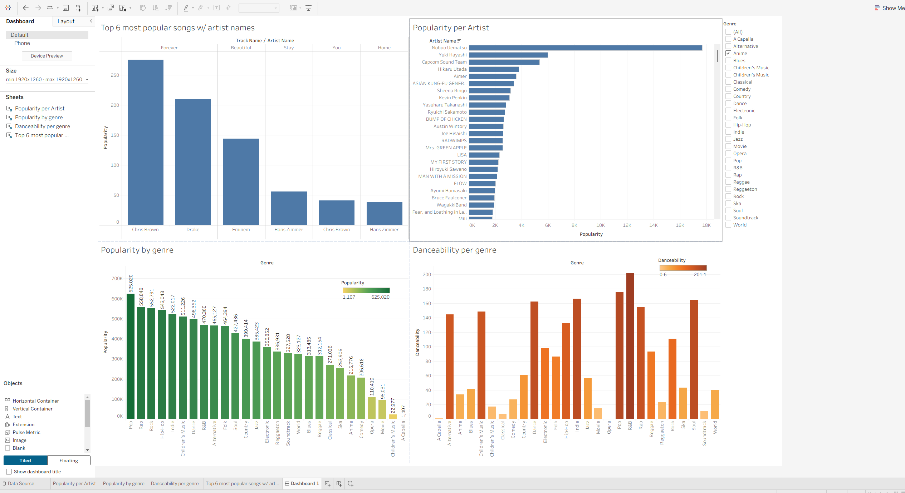
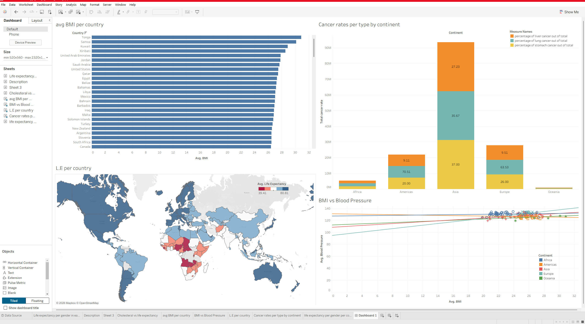

# Tableau Dashboards

This repository contains Tableau dashboards created to analyse Spotify and World Health datasets.

## Spotify Dashboard

### Project Overview

This dashboard analyses Spotify data to explore trends in music popularity, artists and track characteristics.

I chose to focus on the following aspects in particular:
- Top 6 most popular songs
- Popularity per artist with a genre selector 
- Popularity by genre
- Danceability per genre

### Technologies Used
- Tableau
- Tableau Public

### Dashboard Preview

Key Insights:
- Pop was the most popular genre, followed by Rap, Hip-Hop, Rock and Indie. This could help Spotify prioritise recommendations and promotional content.
- R&B was the most danceable genre, while Opera was the least danceable. This could support playlist curation and recommendation systems.
- Artist popularity varied significantly between genres, helping identify leading artists within each category.
- The dashboard identified the most popular tracks in the dataset, providing insight into current listener preferences.

[View Dashboard on Tableau Public](https://public.tableau.com/views/Spotify_Dataset_17900833912310/Dashboard1?:language=en-GB&:sid=&:redirect=auth&:display_count=n&:origin=viz_share_link) 

## World Health Dashboard

### Project Overview

This dashboard explores global health metrics across countries and continents.

I chose to focus on the following aspects in particular:
- Average BMI per country
- Cancer rates per continent
- Life Expectancy per country
- Correlation between BMI and Blood Pressure

## Dashboard preview

Key Insights:
- Tonga recorded the highest average BMI in the dataset.
- Most countries with the highest BMI values were located in Oceania and Asia.
- A positive relationship was observed between BMI and blood pressure.
- African countries generally showed lower life expectancy than other regions.
- These findings could support targeted public health initiatives and resource allocation.

[View Dashboard on Tableau Public](https://public.tableau.com/views/Health_Survey_Data/Dashboard1?:language=en-GB&:sid=&:redirect=auth&:display_count=n&:origin=viz_share_link)

## Skills Demonstrated:
- Dashboard creation
- Interactive filters
- Data visualisation
- Geographic analysis
